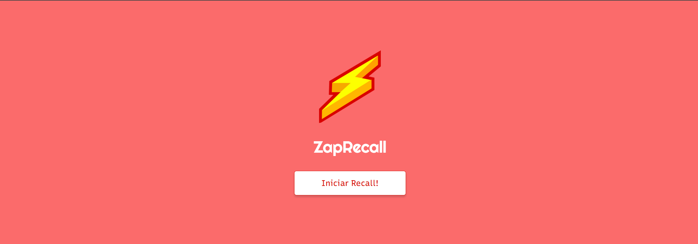

# 
Zap Recall

### 
Tecnologias utilizadas:

   
   
   
  

## 📖 Descrição
Nesse projeto fizemos um aplicativo com o bjetivo de contribuir no processo de aprendizagem das pessoas.O desenvolvimento envolveu várias etapas e a integração de diferentes tecnologias como HTML5, CSS3, JavaScript e React. Com esse aplicativo é possível criar um deck de perguntas e respostas para aprimorar a memorização de conteúdos.

## 🚀 Instalação
Baixe o repositório do projeto no github e execute em sua máquina.

## 💻 Preview

## 🎮 Usando

$~$

[🔝 De volta ao topo](#Zap_Recall)

